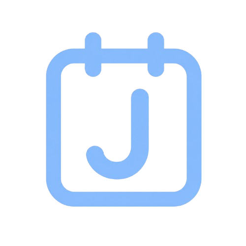

<p align="center">
  
</p>

<h1 align="center">잡플래너</h1>

<p align="center">
  취업 준비의 할 일, 기업 일정, 일기, 언젠가를 한곳에서 보는 Flutter 앱입니다.<br>
  서버 없이 기기에만 저장하고, 안드로이드와 iOS를 같은 코드로 만듭니다.
</p>

<p align="center">
  
  
  
</p>

---

## 왜 만들었나요

취준은 할 일과 면접 일정이 섞이고, 기업마다 전형이 다릅니다. 잡플래너는 달력 위에 그걸 올려 두고, 홈에서 오늘·내일·남은 일을 바로 보게 하려는 앱입니다.

데이터는 계정 로그인 없이 **이 폰(또는 이 맥)에만** 남습니다. 백업 파일로 옮기거나 복구할 수 있습니다.

## 무엇을 하나요

| 화면 | 하는 일 |
| --- | --- |
| **홈** | 오늘·내일 할 일, 남은 할 일, 언젠가. 카드를 길게 눌러 순서를 바꿀 수 있습니다. |
| **캘린더** | 할 일·기업 전형을 한 달에 모읍니다. 기간·반복·여러 날을 고를 수 있고, 날짜마다 일기·가계부를 남길 수 있습니다. |
| **기업** | 지원 중인 회사를 카드로 두고, 전형과 카테고리로 나눠 봅니다. |
| **설정** | 테마·글꼴·알림·백업·캘린더 가져오기·앱 둘러보기 |

### 알림

- 시간이 있는 할 일은 5분·10분·30분·1시간 전에 알려 줍니다.
- **요약 알림**은 매일 고른 시각에 그날 일정을 모아 보냅니다.
- **미완료 할 일**은 기본 오후 9시에, 그날 끝내지 않은 할 일이 있을 때만 보냅니다.

### 테마와 글꼴

라이트/다크와 함께 벚꽃, 여름 해변, 고양이 마을처럼 분위기를 고르거나, 사진·패턴으로 나만의 테마를 만들 수 있습니다. 본문 글꼴과 할 일·달력 글자 크기도 설정에서 바꿉니다.

### 데이터

- 할 일·기업·일기는 기기의 SharedPreferences와 앱 문서 폴더에 둡니다.
- 설정에서 zip으로 백업하고, 최근 3개까지 앱과 다운로드에 남겨 둡니다.
- 앱을 켤 때 매일·3일·일주일·한 달 주기로 자동 저장할 수 있습니다.

### 캘린더 가져오기

안드로이드에서는 삼성 캘린더(기기 캘린더) 일정을 할 일로 가져올 수 있습니다. 캘린더·기간·할 일·카테고리를 단계별로 고릅니다. iOS 캘린더는 아직 준비 중입니다.

### 홈 화면 위젯

안드로이드와 아이폰 홈에 **오늘**, **내일**, **오늘과 내일**, **일주일** 위젯을 둘 수 있습니다. 아이폰은 잠금 화면에도 오늘 일정을 둘 수 있습니다.

## 이 저장소

윈도우에서 안드로이드를, 맥에서 아이폰을 같은 저장소로 작업합니다.

```
lib/          공통 Dart 코드
android/      안드로이드 (알림, 위젯, 캘린더 가져오기)
ios/          iOS
assets/       아이콘, 테마 이미지, 글꼴
```

플레이스토어와 앱스토어에는 GitHub가 아니라 각각 **AAB**, **IPA**를 올립니다.

## 시작하기

[Flutter](https://docs.flutter.dev/get-started/install)가 설치되어 있어야 합니다.

```bash
git clone https://github.com/jungyuminn/job_planner.git
cd job_planner
flutter pub get
```

안드로이드 (윈도우 또는 맥):

```bash
flutter run
```

아이폰은 **맥 + Xcode**가 필요합니다. USB-C–라이트닝으로 아이폰 12 미니를 연결한 뒤:

```bash
cd ios
pod install
cd ..
flutter run
```

`build/`, `.dart_tool/`, `android/.gradle/`는 올리지 않습니다. 클론한 뒤 각 컴퓨터에서 다시 빌드하면 됩니다.
